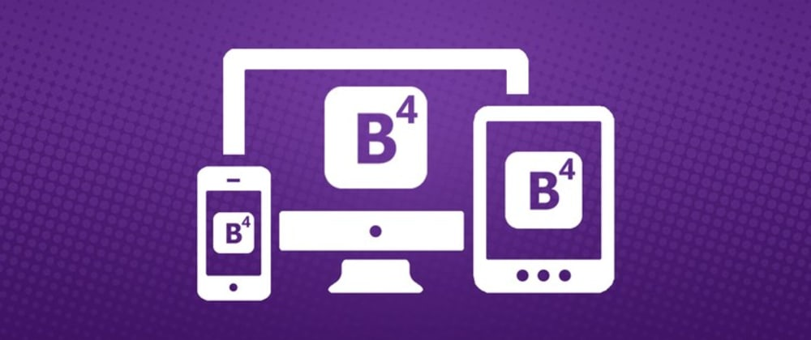

<h3 align="center">
  CaféProjetos - Site para empresa de Consultoria
</h3>

<blockquote align="center">“JUST START."</blockquote> 

  

  <a href="#rocket-sobre-o-desafio">Sobre o site</a>&nbsp;&nbsp;&nbsp;|&nbsp;&nbsp;&nbsp;
  <a href="#meu-resultado">Meu Resultado</a>&nbsp;&nbsp;&nbsp;

## :rocket: Sobre o site

A ideia inicial desse site foi me incentivar a resgatar os conhecimentos que obtive no módulos de HTML/CSS/Boostrap4 do primeiro curso que fiz quando me decidi a me tornar um dev. Precisava de algo que me estimula-se a fazer isso, nada melhor que um projeto para cumprir essa tarefa. 

O site foi feito para uma empresa fictícia de consultoria empresarial. Toda a sua interface foi feita apenas com o HTML, CSS e Bootstrap4. Ela foi criada para uso tanto em desktop como tablet e smartphones. Não tive ajuda alguma de design ou outro dev que podesse compartilhar experiências e dicas de UI & UX então não espere nada tão complexo. Porém usei como parêmetro sites de outras empresas nesse mesmo râmo, isso gerou um resultado ao meu ver bem amigáve ao usuário.

### Funcionalidade do site

- **`Apresentar brevemente a empresa, seus produtos e serviços`**: Deve ser capaz de criar uma lista de todos os repositórios que estão cadastrados na sua API com os campos **title**, **techs** e número de curtidas seguindo o padrão `${repository.likes} curtidas`, apenas alterando o número para ser dinâmico.

- **`Apresentar história da empresa`**: Deve ser capaz de informar em uma página todo a história, objetivo e metas da empresa.

- **`Apresentar todos os produtos`**: Deve ser capaz de informar com detalhes em apenas uma página todos os produtos que a empresa pode oferecer.

- **`Apresentar todos os serviços`**: Deve ser capaz de informar com detalhes em apenas uma página todos os serviços que a empresa pode oferecer.

- **`Apresentar meio de comunicação com a empresa`**: Deve ser capaz de informar todos os meios de comunicação pelos quais a empresa pode ser contatada.

### Meu Resultado

- **`Apresentar brevemente a empresa, seus produtos e serviços`**:

  

- **`Apresentar história da empresa`**:

  

- **`Apresentar todos os produtos`**:

  

- **`Apresentar todos os serviços`**:

  

- **`Apresentar meio de comunicação com a empresa`**:

  

